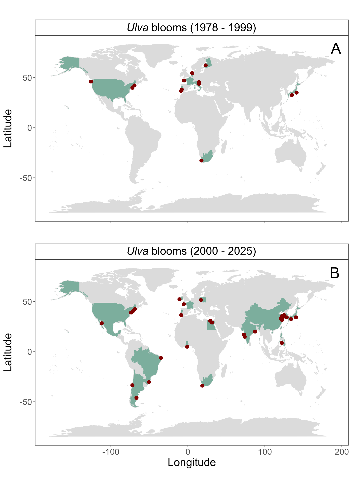
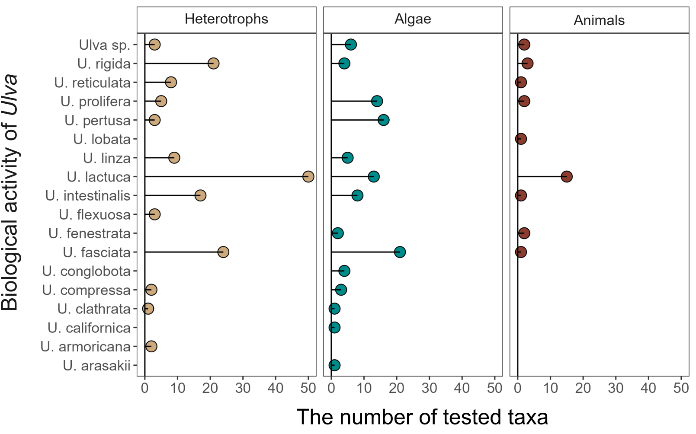
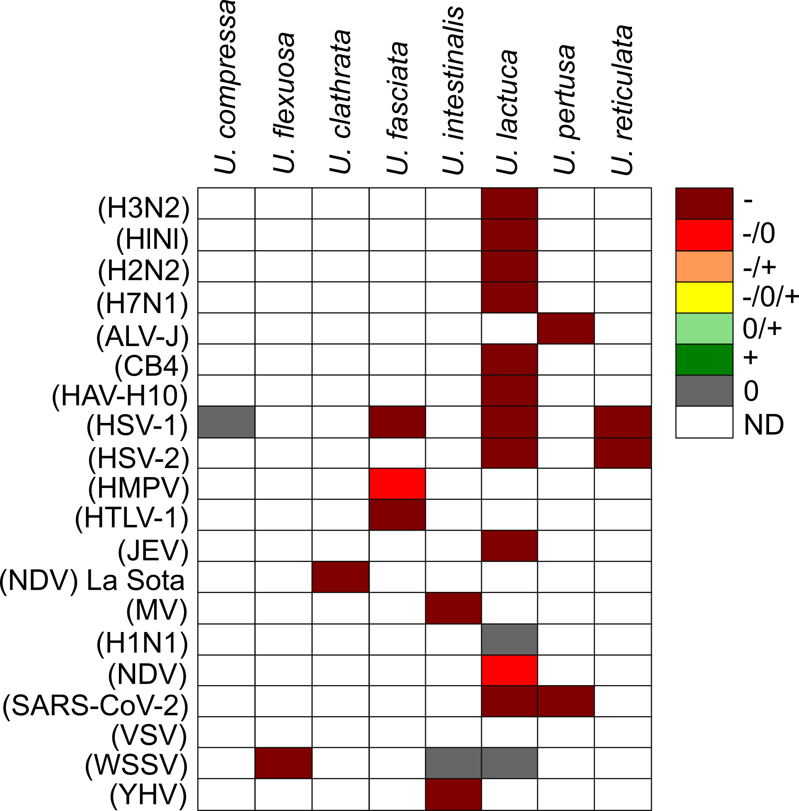
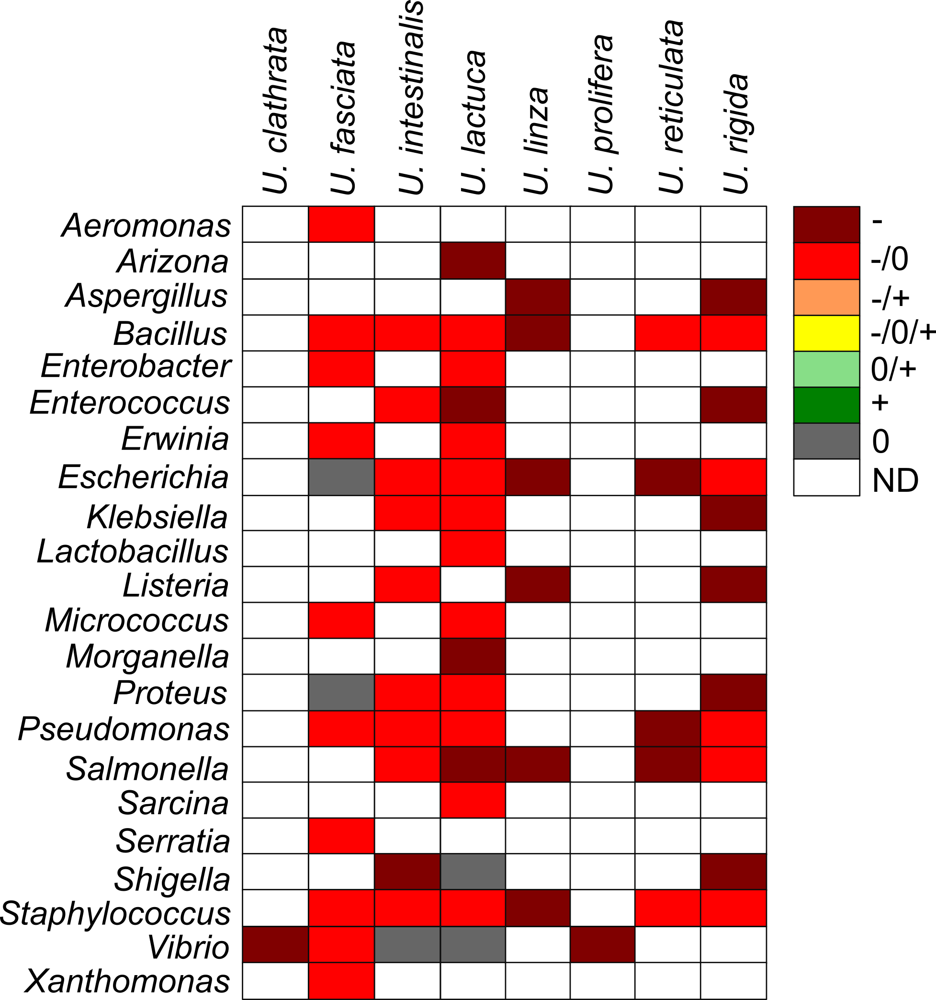
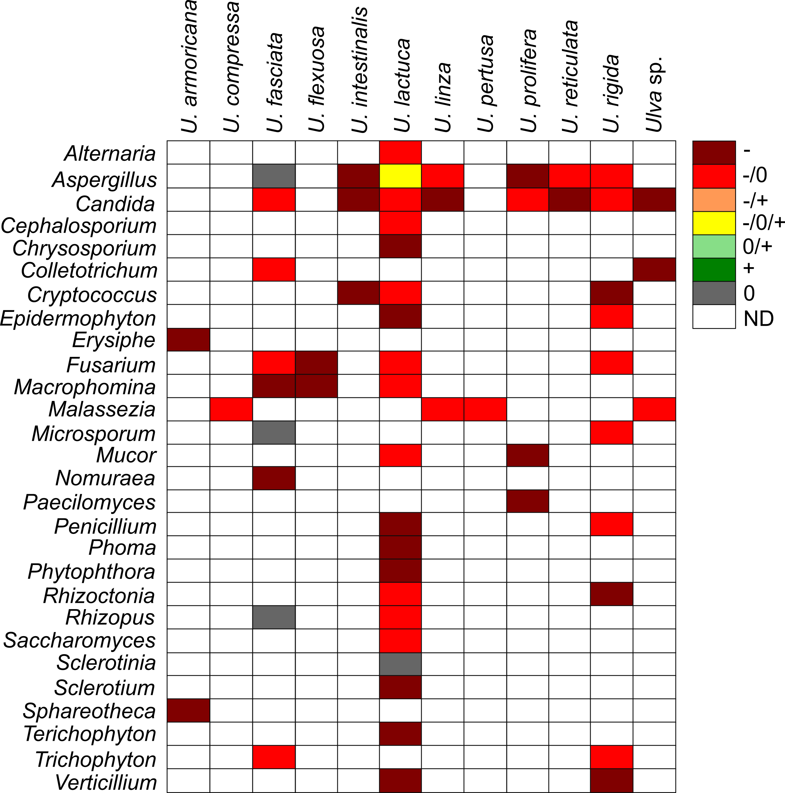
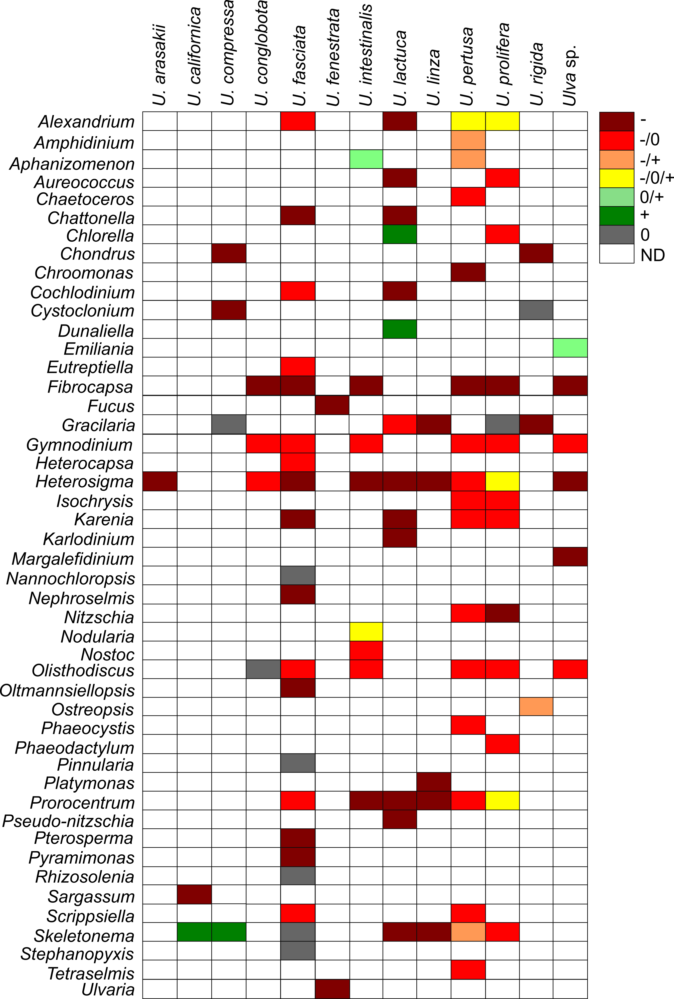
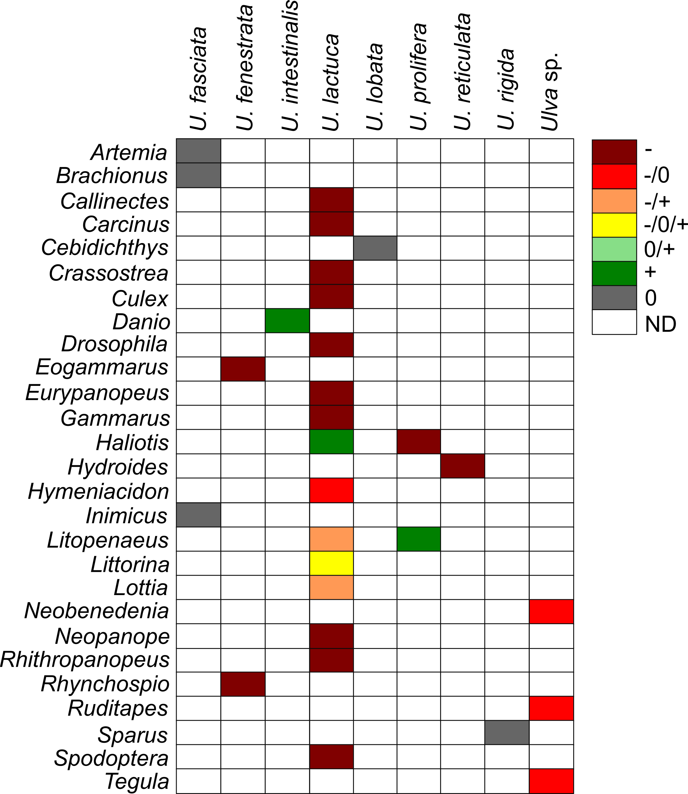

 

# Abstract {.unnumbered}
 

*Ulva* sp. is a hazardous material widely distributed in oceans and estuaries worldwide, posing a significant environmental threat. Massive blooms, commonly referred to as Green Tides, have increased in frequency globally, driven by factors such as light availability, nutrient enrichment, rising sea surface temperatures, and salinity fluctuations. These blooms vary in location, species composition, ecological consequences, and underlying causes. Additionally, *Ulva* sp. produces bioactive compounds that inhibit growth and disrupt vital functions in various plant and animal species. This review summarizes current knowledge on *Ulva* sp., highlighting instances of harmful Green Tides over the past five decades, their detrimental effects on micro- and macroorganisms, and the hazardous compounds involved. Furthermore, we emphasize the need for interdisciplinary research to better understand the ecological risks associated with *Ulva* sp. and its potential implications for human health.

 

# Introduction {.unnumbered}

 

Aquatic green macroalgae *Ulva* is a genus that raises a lot of controversy. *Ulva* is a species that has recently been intensively promoted, especially in scientific journals focusing on the optimization and commercialization of new organisms for commercial purposes. Mass cultivation of *Ulva* sp. in outdoor open cultivation ponds of 1000 m^2^ can produce approximately 10 tons of dry biomass per year [@simonApplicationsUlvaBiomass2022]. *Ulva* sp. has gained recognition as a profitable food source, cosmetic product, or as an environmental bioremediation agent due to its ability to absorb large amounts of heavy metals and other hazardous pollutants [@mantriConciseReviewGreen2020; @simonApplicationsUlvaBiomass2022]. 

However, despite its nutritional and commercial benefits, *Ulva* sp. poses environmental and potential health risks that merit caution and consideration. Unfortunately, the lack of sufficient knowledge about the ecophysiology of *Ulva* sp. and unified rules and methods for obtaining biomass may lead to numerous abuses. For instance, it is possible to use *Ulva* biomass from sewage treatment plants or dead thallus obtained after bloom event as a source of cosmetics or food products. It has now become a fact that algae-based food supplements may be harmful to human health due to the high content of heavy metals including cadmium (Cd), lead (Pb), or mercury (Hg) [@rzymskiMultidisciplinaryApproachSafety2015].

It is well-established that *Ulva* sp. produces a diverse array of harmful secondary metabolites. Nevertheless, the extent of their hazardous effects on the surrounding ecosystem remains uncertain. Given the ability of *Ulva* sp. to inhibit the growth of competing algal and plant species, as well as to cause the mortality of various animal taxa, including vertebrates, an important question arises whether *Ulva* sp. is actually a safe and beneficial organism, or rather a threat to the environment.

Here, we reviewed the general classification and morphological differences of the *Ulva* genus and the locations of occurrence and physiological features that help this green algae adapt to changing environmental conditions. Next, we summarized available reports on the locations of *Ulva* sp. blooms in aquatic ecosystems and their broad consequences. We also presented the most frequently used methods for testing the biological activity of *Ulva* sp. and their active compounds that affect the surrounding ecosystem. At the end, we compiled reports on the harmful effects of *Ulva* on viruses, bacteria, fungi, micro- and macroalgae, as well as invertebrates and vertebrates. This article highlights the need for interdisciplinary research aimed at shedding light on the basic mechanisms governing the occurrence and succession of green algae in coastal seas as well as drawing the attention of the public to the fact that *Ulva* sp. is an organism that poses a real threat to the functioning of the aquatic environment and causes financial damage in a global scale.

 

# Classification and morphology of *Ulva* sp. {.unnumbered}

 

The genus *Ulva* was first described by Carolus Linnaeus in Species Plantarum [@linnaeusSpeciesPlantarumExhibentes1797]. In modern classification, *Ulva* belongs to the phylum Chlorophyta, class Ulvophyceae (K.R. Mattox & K.D. Stewart), order Ulvales (Blackman & Tansley), and family Ulvaceae (J.V. Lamouroux ex Dumortier) [@guiryAlgaeBaseWorldwideElectronic2017]. Phylogenetic studies have merged *Ulva* and *Enteromorpha* into a single genus [@haydenLinnaeusWasRight2003; @shimadaMolecularPhylogeneticAnalyses2003], with 102 taxonomically accepted species worldwide [@guiryAlgaeBaseWorldwideElectronic2017]. The most commonly occurring *Ulva* species are shown in Fig. <a href="#fig:Ulvamorphology">1</a>.

 

 

Historically, species identification relied on morphological and anatomical traits, including thallus shape and size, presence of dentation, thickness, cell structure, and number of pyrenoids. However, these characteristics can be highly variable due to factors such as age, reproductive state, grazing pressure, and environmental conditions [@guiryAlgaeBaseWorldwideElectronic2017]. Consequently, molecular markers are increasingly used for taxonomic classification, leading to the discovery of new free-floating *Ulva* species associated with Green Tides [@kaziMorphologicalMolecularCharacterization2016; @kangEvaluatingBloomPotential2021; @wanAssessmentCharacterisationIrelands2017; @krupnikNativeInvasiveCryptogenic2018].

The mature *Ulva* sp. thallus consists of a flattened, distromatic blade, where two layers of independent but closely associated cells form the structure. Thallus morphology varies widely, ranging from broad, irregularly lobed blades to linear, lanceolate, or oblanceolate shapes. Some species, such as *U. reticulata*, have perforated blades, while others, like *U. rigida*, *U. scandinavica*, and *U. taeniata*, remain unperforated. The thallus can grow up to one meter under optimal conditions [@guiryAlgaeBaseWorldwideElectronic2017]. Pigmentation varies from dark green to pale yellow, and vegetative cells contain a single chloroplast and one or more pyrenoids. Starch content, which serves as a reserve material, fluctuates between 1.59% and 21.44%, depending on growth conditions and seasonality [@kazirPhysicochemicalRheologicalDigestibility2021].

Morphological variation in *Ulva* sp. is influenced not only by physical and chemical environmental factors but also by microbial associations. Major bacterial groups such as Bacteroidetes and Planctomycetes colonize U. australis surfaces [@tujulaAnalysisEpiphyticBacterial2006], and similar bacterial communities have been found in *Ulva* sp. from different habitats [@goeckeChemicalInteractionsMarine2010]. The interaction between *Ulva* sp. and bacteria is crucial for normal morphological development. In axenic culture, *Ulva* sp. loses its typical form, but co-cultivation with bacterial isolates restores its normal structure [@provasoliBacteriaInducedPolymorphism1980]. Spoerner et al. [@spoernerGrowthThallusMorphogenesis2012] demonstrated that regulatory compounds secreted by Cytophaga MS6 (with auxin-like activity) and Roseobacter MS2 (with cytokinin-like activity) influence the growth and morphogenesis of *U. mutabilis*.

 

# Occurrence and physiology of *Ulva* {.unnumbered}

 

*Ulva* is a cosmopolitan genus found in oceans and estuaries worldwide [@guiryAlgaeBaseWorldwideElectronic2017]. Its successful colonization across diverse environments is attributed to physiological, biochemical, and molecular adaptations. *Ulva* sp. is distributed across all seven continents, including Antarctica. Asia records the highest species diversity with 56 species, followed by Australia (40 species), Europe (38 species), North America (34 species), Africa (31 species), South America (20 species), and Antarctica (12 species) [@mantriConciseReviewGreen2020].

The broad distribution of *Ulva* sp. is due to its remarkable tolerance and adaptation to key environmental factors such as light, temperature, and salinity. It can thrive in both freshwater and marine habitats. Marine species typically inhabit coastal zones to depths of 40 meters [@chapmanMarineAlgaeNew1956], while freshwater species have been documented in central Europe (e.g., *Ulva flexuosa*; [@rybakRevisionHerbariumSpecimens2015]) and on Japan's Ryukyu Islands (*Ulva limnetica*; [@ichiharaNewSpeciesFreshwater2009]). Additionally, species like *Ulva lactuca*, *Ulva rigida*, *Ulva compressa*, and *Ulva pertusa* can tolerate salinity gradients ranging from less than 0.5 to 49 PSU [@hofmannCrypticDiversityUlva2010]. Seasonal growth patterns show increased abundance during spring and summer, as warmer temperatures enhance growth and reproduction [@caniguanSeawaterTemperatureTidal2024; @uchimuraEcologicalStudiesGreen2004]. For instance, the optimal temperature for spore/gamete release and growth in *U. prolifera* is 20–27°C [@wangComparativeStudiesAllelopathic2006], with blooms typically occurring at 23–26°C [@liPhysiologicalResponsesGreen2017]. Moreover, *Ulva* sp. exhibits a linear growth response to light intensity up to 30 μmol photons m^−2^s^−1^, reaching saturation above 70 μmol photons m^−2^s^−1^ [@fortesGrowthRatesNorth1980]. Its opportunistic nature—marked by rapid nutrient uptake and fast growth rates—can lead to explosive increases in biomass [@melton3rdMolecularIdentificationNutrient2016; @huRemoteEstimationBiomass2017]. Wu et al. [@wuPhysiologicalAcclimationUlva2022] noted that the formation of air sacs in *Ulva* is influenced by adaptive changes in temperature and light, while settlement in U. prolifera is triggered by temperatures exceeding the optimal range.
*Ulva* sp. reproduces both sexually and asexually. Its sexual cycle is characterized by an isomorphic alternation of generations, with morphologically similar but genetically distinct sporophyte and gametophyte phases. In addition, *Ulva* sp. can reproduce asexually through biflagellate zoospores and by parthenocarpy, enhancing its reproductive versatility [@mantriConciseReviewGreen2020]. The haploid thallus typically contains between 5 and 13 chromosomes [@guiryAlgaeBaseWorldwideElectronic2017].
Adaptation of the light-harvesting pigments is another key physiological feature. *Ulva* sp. contains chlorophyll *a* along with accessory pigments such as chlorophyll *b* and carotenoids (Fig. <a href="#fig:SpectraUlva">2</a>). Recent analyses of absorption spectra and chromatographic retention times have confirmed the presence of carotenoids including lutein, *β*-carotene, neoxanthin, *β*-cryptoxanthin, violaxanthin, antheraxanthin, and zeaxanthin, although total pigment yield varies with species [@eismannUlvaSppCarotenoids2020].

 

 

# Prevalence and consequences of *Ulva* blooms {.unnumbered}

 

*Ulva* is notorious for its rapid and uncontrolled proliferation, leading to phenomena known as Green Tides. Although these blooms share common traits, they vary widely in location, causative organisms, triggers, and impacts. Green Tides affect diverse sites and impose significant economic and environmental burdens, drawing attention from both scientists and policymakers [@yeGreenTidesAre2011]. In addition to adversely impacting tourism [@villaresNitrogenPhosphorusUlva1999], large algal mats can create a hostile physico-chemical environment. These mats may blanket surfaces, alter sediment chemistry [@raffaelliRoleEpibenthicCrustacean1989; @gamenickHypoxiaSulphideStructuring1996; @valielaMacroalgalBloomsShallow1997], induce sulfide poisoning [@gamenickHypoxiaSulphideStructuring1996], and generate anoxic conditions at the water-sediment interface [@norkkoDriftingAlgalMats2000]. They can also modify bird feeding behaviors [@raffaelliRoleEpibenthicCrustacean1989], smother seagrass beds [@denhartogSuffocationLittoralZostera1994], and interfere with water use due to floating masses of detached algae. Additionally, they cause aesthetic issues such as odor nuisances and fouling of bathing waters [@montgomeryGuidelinesDredgedMaterial1978; @charlierHowBrittanyFlorida2008], and can alter benthic algal communities [@mundaChangesDegradationSeaweed1993; @wormAlgalPropaguleBanks2001].
The frequency of massive Green Tides has increased worldwide ([@smetacekGreenGoldenSeaweed2013]; Fig. <a href="#fig:map">3</a>). Until 1999, *Ulva* sp. blooms were primarily recorded in Europe, the USA, South Africa, and Japan. Over the past 25 years, however, these blooms have spread significantly, with only Australia and Antarctica yet to report such events (Fig. <a href="#fig:map">3</a>, Table 1). The dispersal of free-floating thallus fragments can initiate new blooms in previously unaffected areas, posing serious ecological and economic challenges. Notably, newly identified species such as *U. pseudo-ohnoi* sp. nov. have also been implicated in massive bloom events [@leeTaxonomyUlvaCausing2019].

 

 

Multiple factors contribute to the formation and persistence of *Ulva* sp. blooms. The widespread distribution of both microscopic and macroscopic stages of *Ulva* sp. plays a role in the global outbreak of Green Tides [@teichbergEutrophicationMacroalgalBlooms2010; @jonesGreenMacroalgaeBlooms2020]. Excess nutrient inputs from agricultural runoff or wastewater discharge, combined with eutrophication, create ideal conditions for bloom formation [@teichbergEutrophicationMacroalgalBlooms2010]. Additionally, the high surface-to-volume ratio of *Ulva* sp. enhances its rapid growth [@vanalstyneEnvironmentalChemistryChemical2015], and conditions such as brackish salinity and a pH near 7.0 have been linked to significant increases in biomass [@linDilutedSeawaterPromoted2011].
Green Tides have become a major concern for scientists, environmental organizations, and policymakers striving to mitigate their impacts on marine ecosystems and coastal communities. These large-scale blooms, particularly prevalent in nutrient-rich coastal areas [@kangEffectsEutrophicationAcidification2017], can alter light availability for phytoplankton and benthic communities over prolonged periods [@maltaVerticalHeterogeneityPhysiological2003]. For example, in the Venice Lagoon, a period of intense *Ulva* growth in the late 1980s was followed by a subsequent decline, which dramatically altered local conditions [@charlierHowBrittanyFlorida2008]. Furthermore, as *Ulva* biomass decomposes and sinks, oxygen depletion can lead to localized hypoxic "dead zones" [@huOriginOffshoreExtent2008].

Economic damages from *Ulva* sp. blooms are also significant. For instance, blooms of *U. lactuca* in coastal waters near urbanized and agricultural regions like Maui, Hawaii, result in annual losses exceeding 20 million dollars [@vanbeukeringEcologicalEconomicModeling2004; @dailerResponsesBloomForming2012]. In Brittany, France, a Green Tide event led to the accumulation of 100,000 tonnes of *Ulva* biomass (primarily *U. armoricana* and *U. rotundata*), costing an estimated US 10–150 per tonne in cleaning and disposal expenses [@charlierHowBrittanyFlorida2008]. Similarly, in 2008, a 30-kilometer-long bloom of *U. prolifera* along the Qingdao coast in China required the disposal of over 1 million tonnes of biomass at a cost of US 30 million, employing 10,000 individuals [@yeGreenTidesAre2011; @shiSpatialTemporalNutrient2015; @mantriConciseReviewGreen2020]. The emergency response costs prior to the 2008 Beijing Olympic Games sailing competition in Qingdao were estimated at around 200 million euros, amounting to 5.84% of Qingdao Municipality's total income for that year [@berdaletMarineHarmfulAlgal2016].

 

**Table 1.**
Examples of *Ulva* blooms reported in different parts of the world's coastlines. 

 
Dong et al. [@dongTwoTreatmentMethods2023]
Cai et al. [@caiCompleteGenomeSequence2025]
Zhang et al. [@zhangAutomaticDetectionFloating2024]
Liu et al. [@liuUlvaDiversityYellow2010]
Lü et al. [@luGreenTideYingkou2022]
Gong et al. [2024], Xia et al. [2024], Zhang et al. [2019], Xu et al. [2014]
Liu et al. [@liuExplorationImplicationGreen2025]
Su et al. [@suUnforeseenGreenTide2025]
Feng et al. [@fengColorsMacroalgaeDistinguishing2025]
Qi et al. [@qiLongtermTrendUlva2016]
Hu et al. [@huInterannualSpatialVariations2024]
Abduraup et al. [@abduraupLocalPerceptionsUse2025]
Liu et al. [@liuChangesStructureMicrobial2024]
Yoshida et al. [@yoshidaPersistentOccurrenceFloating2015]
Choi et al. [@choiGoneWindDisappearance2024]
Samanta et al. [@samantaStableCarbonNitrogen2019], Kang et al. [@kangEvaluatingBloomPotential2021]
Lee et al. [@leeTaxonomyUlvaCausing2019]
Yabe et al. [@yabeGreenTideFormed2009]
Bast et al. [@bastStrongEndemismBloomforming2014]
Bast et al. [@bastStrongEndemismBloomforming2014]
Peter et al. [@peterComprehensiveStudyEcological2024]

Viaroli et al. [@viaroliSaccaDiGoro2006], Viaroli et al. [@viaroliNutrientIronLimitation2005]
Ménesguen et al. [@menesguenNewNumericalTechnique2006]
Charlier et al. [@charlierHowBrittanyFlorida2008]
Ménesguen et al. [@menesguenUlvaMassAccumulations2010], Louis et al. [@louisMultiyearRenewalGreen2023], Jones et al. [@jonesGreenMacroalgaeBlooms2020]
Herrero et al. [@herreroMonitoringInvasiveMacroalgae2023]
Aníbal et al. [@anibalMudflatSurfaceMorphology2007]
Rybak and Gąbka [@rybakInfluenceAbioticFactors2018]
Martins et al. [@martinsHydrodynamicsMajorFactor2001]
Malta and Verschuure [@maltaEffectsEnvironmentalVariables1997], Malta et al. [@maltaVerticalHeterogeneityPhysiological2003]
Runca et al. [@runcaControlMacroalgaeBlooms1996]
Sfriso et al. [@sfrisoMacroalgaePhytoplanktonStanding1989]
Wan et al. [@wanAssessmentCharacterisationIrelands2017]
Bermejo et al. [@bermejoSpatialTemporalVariability2019]
Back et al. [@backMassOccurrenceUnattached2000]

Xing et al. [@xingEnvironmentalDNADetection2024]
Kennish et al. [@kennishBenthicMacroalgalBlooms2011]
Granger et al. [@grangerAssessmentEutrophicationGreenwich2000]
Guidone and Thornber [@guidoneExaminationUlvaBloom2013]
Chávez-Sánchez et al. [@chavez-sanchezRecruitmentUlvaBlooms2017]
Nelson et al. [@nelsonSeasonalSpatialPatterns2003]

Mutizabal-Aros et al. [@mutizabal-arosPhysiologicalAnalysisDesiccation2024]
Mutizabal-Aros et al. [@mutizabal-arosMorphologicalMolecularIdentification2024]
Puppin-Gonçalves et al. [@puppin-goncalvesUlvaLactucaBlooms2024]
Lanari and Copertino [@lanariDriftMacroalgaePatos2017]
Becherucci et al. [@becherucciTidalActionMacroalgal2021]

Human et al. [@humanInsightsCauseUlva2016]
Anderson et al. [@andersonEffectLocalisedEutrophication1996]
Allanson et al. [@allansonObservationsDistributionAbundance2016]
Hosny et al. [@hosnyIntercellularExtracellularAmino2022]
Ahmed et al. [@abuahmedUlvaSpeciesBlooms2021]
Granger et al. [@grangerDeterminingOriginEcology2012]
 

# Methods of testing bioactivity of *Ulva* {.unnumbered}

 

To assess the impact of *Ulva* sp. on other organisms, researchers employ a variety of investigative approaches. Common methods include adding extracts, conducting experiments with fresh thalli, performing co-culture assays, and carrying out field observations. In many studies, several methods are applied simultaneously for comparative analysis.
The most frequently used technique involves preparing extracts from dried *Ulva* sp. thalli. In this approach, a dry sample is ground and mixed with distilled water, seawater, or chemical reagents, followed by high-speed centrifugation or filtration. A specific dose of the resulting extract is then introduced to the target organism. A second method involves the use of cell-free filtrates. In this procedure, *Ulva* sp.—with a known biomass and maintained under controlled conditions—is cultivated for several days. The thalli are then removed, and the filtrate, containing bioactive compounds, is used to inoculate cultures of the target organisms. A third approach is the direct inoculation of fresh *Ulva* sp. thalli into cultures of the test organisms [@jinComparativeStudiesAllelopathic2003; @jinAllelopathicGrowthInhibition2005; @nanAllelopathicEffectsUlva2008; @caiInteractionUlvaPertusa2011; @wangComparativeStudiesAllelopathic2006; @lvAllelopathicEffectsUlva2021; @salamaBiointerferenceRelationshipMacroalga2021]. Additionally, isolation co-culture assays have been employed by Wang et al. [@wangComparativeStudiesAllelopathic2006] and Jin and Dong [@jinComparativeStudiesAllelopathic2003], whereby direct contact between the target species and *Ulva* sp. is prevented. Mesocosm experiments, using floating tanks deployed at the sampling site, allow *Ulva* sp. to be maintained under ambient conditions similar to its natural habitat [@tangGreenMacroalgaUlva2011]. Tang and Gobler [@tangGreenMacroalgaUlva2011] also conducted bottle incubation experiments as part of their field studies.

 

#  The effect of *Ulva* on surrounding ecosystem {.unnumbered}

 

Evidence indicates that *Ulva* sp. exhibits significant bioactivity against a variety of heterotrophic microorganisms, microalgae, seaweeds, grazers, and other animals. Most research has focused on species such as *Ulva lactuca*, *U. fasciata*, and *U. rigida* (Fig. <a href="#fig:Lolli">4</a>), with a detailed summary provided in the Supplementary Materials.

 

 

##  *Ulva* sp. as a hazardous material affecting heterotrophic microorganisms {.unnumbered}

 

Research has demonstrated that various *Ulva* species can impact viruses, bacteria, and fungi (Figs. <a href="#fig:viruses">5</a>, <a href="#fig:bacteria">6</a>, <a href="#fig:fungi">7</a>). Studies have documented effects on 20 different virus types, 22 heterotrophic bacterial types, and 28 fungal taxa, with *Ulva lactuca* being the most extensively tested—against 50 different taxa of heterotrophic microorganisms. Generally, these studies report a strongly or moderately inhibitory effect of *Ulva* compounds on microbial development. Notably, only certain species within the *Aspergillus* genus have exhibited growth stimulation under the influence of compounds secreted by *Ulva lactuca* (Figs. <a href="#fig:fungi">7</a>). Frequently tested bacteria include strains of *Bacillus*, *Escherichia*, and *Staphylococcus* (Figs. <a href="#fig:bacteria">6</a>). Recent research also indicates that *Ulva* can actively inhibit viruses, including SARS-CoV-2 (Figs. <a href="#fig:viruses">5</a>).

 

 

 

 

##  *Ulva* as a hazardous material affecting microalgae and seaweeds in the aquatic environment {.unnumbered}

 

Our comparative analysis reveals that both micro- and macroalgae constitute the largest group of organisms evaluated for the effects of *Ulva* compounds (Figs. <a href="#fig:Algae">8</a>). Testing has encompassed 21 taxa within Dinoflagellata, 17 within Heterokontophyta, 13 within Chlorophyta, 7 within Rhodophyta, 3 each from Cyanobacteria and Haptophyta, and single taxa from the Cryptista and Euglenophyta phyla. The majority of these organisms exhibit strong to moderate growth inhibition. Although a few studies suggest that *Ulva* may negatively affect marine vascular plants such as *Zostera* sp. [@olyarnikMultiyearStudyEffects2012], some reports indicate that compounds secreted by *Ulva* can positively influence terrestrial crops and vegetables; however, these effects appear to be of limited ecological significance.

 

 

##  *Ulva* as a hazardous material affecting invertebrates and vertebrates {.unnumbered}

 

Research indicates that *Ulva* sp. secretes compounds that adversely affect the development and physiology of various invertebrates and vertebrates (Figs. <a href="#fig:Lolli">4</a>, <a href="#fig:animals">9</a>); Supplementary Materials). Investigations have covered seven animal phyla: 14 taxa from Arthropoda, 8 from Mollusca, 4 from Chordata, and one taxon each from Rotifera, Echinodermata, Porifera, and Platyhelminthes. The majority of these studies report growth inhibition or mortality following exposure to *Ulva*-derived compounds. However, some taxa, including *Artemia*, *Brachionus*, *Cebidichthys*, *Inimicus*, and *Sparus*, have shown resistance. Conversely, species such as *Danio*, *Haliotis*, and *Litopenaeus* may experience growth stimulation under the influence of compounds from certain *Ulva* genera.

Additionally, *Ulva* sp. is typically free of macroinvertebrate colonization due to the production of antifouling agents in the thallus boundary layer. These waterborne toxic macromolecules originate both from the thalli and their associated epibiotic bacteria [@harderWaterbornePolarMacromolecules2004]. For example, *U. reticulata* secretes bioactive substances, supplemented by bacterial compounds, to repel fouling organisms [@dobretsovEffectBacteriaAssociated2002; @harderWaterbornePolarMacromolecules2004]. Egan et al. [@eganPhylogeneticRelationshipAntifouling2000] further reported that bacteria on the surface of *U. lactuca* inhibit the growth of bacteria, fungi, invertebrate larvae, and microalgae, although research in this area remains limited.

 

 

# Active compounds and secondary metabolites of *Ulva* genus {.unnumbered}

 

*Ulva* sp. harbors a diverse array of bioactive compounds, many of which have yet to be fully characterized for their potential harmful effects. The thallus of *Ulva* sp. contains amino acids such as cysteinolic acid, cysteic acid, proline, glutamic acid, and chondrine [@holdtBioactiveCompoundsSeaweed2011]. It also comprises various secondary metabolites including terpenes, polyphenolic compounds, hexapeptides, diterpenoids, and steroids [@fujimuraProductionBioflavorRegeneration1990; @flodin4HydroxybenzoicAcidLikely1999; @awadBiologicallyActiveSteroid2000; @chakrabortyAntibacterialLabdaneDiterpenoids2010; @chakrabortyGuaianeSesquiterpenesSeaweed2010; @yildizDeterminationOxidativeCapacity2012; @ennamanySECMA1Mitogenic1998]. Notably, taurine—an amino acid present in *Ulva* sp.—has been shown to act as a broad-spectrum cytoprotective agent [@itoSeaweedChemicalComposition1989; @pena-rodriguezChemicalCompositionCultivated2011].

Moreover, *Ulva* sp. contains polyunsaturated fatty acids; extracts from *U. rigida* have demonstrated antimicrobial activity [@ismailAntimicrobialFattyAcids2018]. Sulphated polysaccharides, particularly Ulvan—a water-soluble compound constituting approximately 8–29% of the dry weight of *Ulva*—have been noted for their anticoagulant activity through thrombin inhibition and potentiation of heparin cofactor II [@maoSulfatedPolysaccharidesMarine2006]. Ulvan is also reported to possess anticancer, antiviral, hypocholesterolemic, hypolipidemic, and neuroprotective properties [@kaefferBiologicalPropertiesUlvan1999; @smitMedicinalPharmaceuticalUses2004; @rahimiUlvanGreenAlgae2016; @liAntioxidantActivityPurified2018; @olasehindeMacroalgaeValuableSource2019]. In contrast, Barakat et al. [@barakatChemicalCharacterizationBiological2022] reported that ulvan adversely affected microalgae and certain bacterial and fungal species, such as *Klebsiella pneumoniae*, *Staphylococcus epidermidis*, *Enterococcus faecalis*, and *Candida albicans*. Additionally, studies by Alamsjah et al. [@alamsjahAlgicidalActivityPolyunsaturated2009] indicated significant cell mortality in several microalgal taxa—caused by compounds from *U. fasciata* and *U. pertusa*—with tetraenoic acid and α-linolenic acid identified as key inhibitory agents. Lv et al. [@lvAllelopathicEffectsUlva2021] further demonstrated that hexadecanoic acid, octadecatetrienoic acid, and octadecenoic acid produced by *U. linza* induce cell death in species such as *Prorocentrum minimum* and *Platymonas helgolandica*. These findings underscore that *Ulva* sp. synthesizes a range of secondary metabolites with potent bioactivities that may have deleterious effects on various organisms.

 

**Table 2.**
Bioactive compounds produced by *Ulva* and their biological activity on tested organisms.

 

Mao et al. [@maoSulfatedPolysaccharidesMarine2006]
Ismail et al. [@ismailAntimicrobialFattyAcids2018]
Ito and Hori [@itoSeaweedChemicalComposition1989], Peña-Rodríguez et al. [@pena-rodriguezChemicalCompositionCultivated2011]
Lv et al. [@lvAllelopathicEffectsUlva2021]
Alamsjah et al. [@alamsjahIsolationStructureDetermination2005], Alamsjah et al. [@alamsjahAlgicidalActivityPolyunsaturated2009]
Barakat et al. [@barakatChemicalCharacterizationBiological2022]

 

# Conclusions {.unnumbered}

 

This review demonstrates that *Ulva* sp. is a globally distributed macroalga whose extensive physiological and molecular adaptations enable its widespread occurrence. Although *Ulva* sp. offers potential benefits for commercial applications such as food production, cosmetics, and bioremediation, its propensity to form massive blooms—known as Green Tides—poses significant environmental and economic challenges. The diverse methods employed to test the bioactivity of *Ulva* sp. reveal that its secondary metabolites have far-reaching inhibitory effects on heterotrophic microorganisms, microalgae, seaweeds, and even various invertebrates and vertebrates. These compounds, including amino acids, terpenes, polyphenolics, and sulphated polysaccharides, underscore the dual nature of *Ulva* sp. as both a resource and a hazardous material.
The evidence presented highlights the critical need for further interdisciplinary research to elucidate the mechanisms underlying *Ulva* sp. blooms and to develop effective management strategies. Such efforts are essential to mitigate the ecological disruptions and economic losses associated with these events, while also safeguarding human health and the integrity of marine ecosystems. Ultimately, a balanced approach that integrates advanced molecular techniques with traditional ecological assessments will be key to addressing the complex challenges posed by *Ulva* sp.

 

# CRediT authorship contribution statement {.unnumbered}

 

**Gracjana Budzałek**: Writing – original draft, Resources, Methodology, Investigation, Data curation, Conceptualization. **Kinga Wiśniewska**: Writing – original draft, Validation, Resources, Methodology, Investigation, Data curation. **Anna Dziubińska**: Writing – original draft, Validation, Resources, Methodology, Investigation, Data curation. **Sarah Postuma** Resources, Investigation, Data curation. **Anna Woźniak**: Resources, Investigation, Data curation. **Sylwia Śliwińska-Wilczewska**: Supervision, Project administration, Writing – original draft, Resources, Methodology, Investigation, Data curation, Funding acquisition, Conceptualization, Validation. 

 

# Declaration of Competing Interest {.unnumbered}

 

The authors declare that they have no known competing financial interests or personal relationships that could have appeared to influence the work reported in this paper.

 

# Acknowledgements {.unnumbered}

 

This work was supported by Canada Research Chair in Phytoplankton Ecophysiology (Douglass A. Campbell from Mount Allison University, Canada) and Latitude & Light; NSERC of Canada Discovery Grant (Douglass A. Campbell from Mount Allison University, Canada), and funded by DS. 531-O500-D717-25 (S.Ś-W.) and DS. 531-O402-D031-25 (A.D.).

 

# Data availability {.unnumbered}

Data supporting this study is available on:
https://github.com/FundyPhytoPhys/SynBaltic/Ulva (public GitHub Repository).

Code to perform data processing and analyses is available at https://github.com/FundyPhytoPhys/SynBaltic/Ulva.

 

# References {.unnumbered}
